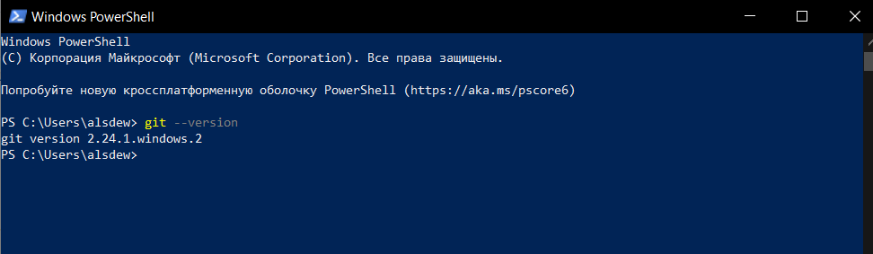

## Установка GIT

**Установка GIT в Windows**

Проверка наличия GIT:

```bash=
> git --version
```


Если GIT уже был установлен, вам отобразится его версия:

 

Для установки GIT перейдите на [страницу](https://git-scm.com/download/win), скачайте подходящий дистрибутив и следуйте инструкциям.


**Установка GIT в LInux Ubuntu (CLI apt)**

Проверка наличия GIT:

```bash=
$ git --version
```

 

Выполните в терминале команду:

```bash=
$ sudo apt install git
```


**Установка GIT в MacOS**

Самый простой — установить *Xcode Command Line Tools*. В версии *Mavericks (10.9)* и выше вы можете добиться этого, выполнив в терминале:

```bash=
$ git --version
```

Если Git не установлен, вам будет предложено его установить.