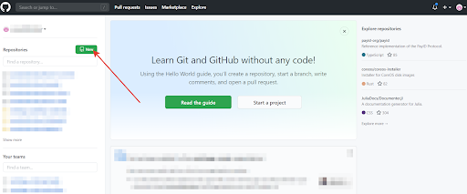
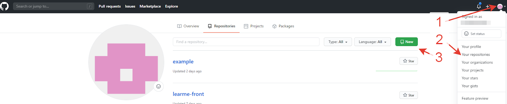

[<к содержанию](./readme.md)

## GitHub

**Регистрация на github.com*

Для регистрации на *github.com*:

1. Перейдите по ссылке https://github.com/.

2. Выберите *«Sign up»*.

3. Заполните информацию.

4. Нажмите кнопку *«Create account»*.

5. Войдите в почту, подтвердите почтовый адрес.

**Создание проекта на github.com**

Для создания репозитория на *GitHub* используйте кнопку «new» на главной странице или на странице со списком репозиториев.

 

  

После создания удаленного репозитория свяжите проект с ним. 